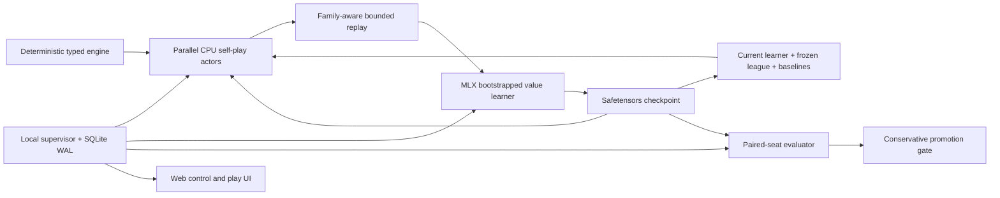

# Astrosynapse 3 design

Astrosynapse 3 is the corrected training generation inside the Astrosynapse 2 application. It targets the original Star Realms base set, keeps retained legacy actors playable, and replaces the policy-improvement contract that stalled during the 4-million-game Astro2 run.

The design target is the strongest model this specific 16 GB Apple M4 machine can produce in one active training day. That is a measurable engineering target, not a promise of a particular playing strength: the dashboard reports real throughput, confidence intervals, and comparisons with frozen anchors so the result can be judged honestly.

## Why the earlier approaches plateaued

The audit found several problems that model size could not repair:

- A match-average result was assigned to every decision from every winning and losing game in that match. Most per-game learning signal was erased.
- Rollout probabilities and PPO update probabilities were computed from different behavior policies, invalidating the importance ratios.
- Card zones were reduced to sums of hand-authored attributes. Exact card identity and within-card relationships disappeared, while arbitrary list positions became numeric features.
- Common and forced choices crowded rare tactical decisions out of the sample budget.
- A 24-game, 60% promotion gate let equal models advance by chance roughly 15% of the time.
- Each decision performed its own feature construction and tiny tensor inference, preventing useful batching.

Astrosynapse 2 corrected those original PPO problems, but its later training regime developed a second plateau: almost no effective exploration, top-three-only support, frozen-champion behavior, rollback after rejection, collapsed bootstrap heads, uncorrected family oversampling, and an unsafe shared preference loss that strongly taught optional premium-card scrapping. The evidence and checkpoint probes are in the [forensic report](PLATEAU_ANALYSIS_AND_ASTROSYNAPSE3.md).

Astro3 keeps per-game outcomes, exact identities, explicit decision families, forced-action resolution, and paired evaluation. It additionally separates learner from deployable champion, restores exploration across every deployment-eligible action, corrects family-level replay weighting, uses head-specific fixed behavior perturbations, adds relational features, and treats known strategic failures as promotion regressions.

## System map



The browser is only a client. Closing it does not stop a run. The local supervisor owns the training thread, safe-boundary controls, metrics, checkpoints, arena jobs, and interactive games.

## Learning algorithm

### Deep Monte-Carlo action values

The primary learner follows the successful shape of [DouZero](https://proceedings.mlr.press/v139/zha21a.html): score each legal semantic action and regress the chosen action toward the final game result.

For every non-forced choice made by player `p`:

```text
target = 1.0 if p wins
         0.0 if p loses
         0.5 for a genuine completed draw

safety truncation => discard the trajectory

loss = BCEWithLogits(Q(information_state, chosen_action), target)
```

There is no hand-authored deck-quality reward and no authority-margin reward. Winning is the policy objective. This avoids imposing the same strategic assumptions that limited the first system. Dense shaping is deliberately excluded because arbitrary shaping can change the optimal policy; the classic invariance result applies only to potential-based shaping ([Ng, Harada, and Russell](http://aima.eecs.berkeley.edu/~russell/papers/icml99-shaping.pdf)).

Monte-Carlo targets are noisy, but each result is an unbiased sample of the behavior policy's return for that chosen information-state action and is replayable. It is not an unbiased label for unchosen actions or for the optimal policy. In this domain the conservative trade is useful while the result is binary, legal actions vary, and the game is stochastic and partially observed. Search-improved action-set targets remain the planned credit-assignment upgrade; search must use public beliefs rather than leaking simulator-hidden state.

### Coherent exploration

Five bootstrapped Q heads share the network trunk. Most trajectories sample one head per player for an entire game, so exploration follows a coherent value hypothesis instead of making unrelated random moves at every chooser call. Samples receive lower-overlap Bernoulli masks, and a deterministic random projection specific to the selected head perturbs nondeployment behavior scores, including both greedy and epsilon candidate ranking. That projection is not added to the fitted MLX value or loss, so it is a lightweight mechanism inspired by [Bootstrapped DQN](https://proceedings.neurips.cc/paper/2016/hash/8d8818c8e140c64c743113f563cf750f-Abstract.html) and [randomized prior functions](https://proceedings.neurips.cc/paper/2018/hash/5a7b238ba0f6502e5d6be14424b20ded-Abstract.html), not a fully anchored implementation of the latter. Deployment averages learned heads without the behavior perturbation. Twenty percent of current-v-current batches deliberately use that exact greedy deployment policy; with current self-play at 60%, the stream has a 12% overall scheduled share. Their samples retain a real randomly assigned bootstrap head and required-head mask for learning. This directly trains on the behavior used in arenas and human play without sacrificing head-valid replay metadata.

### Representation

There is no meaningful spatial grid, so a CNN is the wrong inductive bias. The fixed base set is small enough to retain an exact count for every card in every observable zone:

- own hand, draw bag, discard, ships, bases, and known top;
- opponent public discard, ships, bases, known hand/top, and an unknown pool;
- the five-card trade row and remaining public supply information;
- authorities, resources, discard obligations, turn/seat, and rule flags.

Unordered zones are counts, never shuffled list positions. Unobservable opponent hand/deck assignment and deck order are never policy inputs; the publicly inferable combined hidden-pool composition is retained. Every candidate action has semantic features: verb, decision family, source/target zones, source/target card IDs, ability, and actual resource amounts. Opaque engine indices are not learned features.

The compact default network has separate state and action trunks, pre-normalized residual blocks, a decision-family-specific output bank, and five outcome heads. Astro3 adds direct action/state relations for faction synergy, ally potential, target bases, known-top opponent resources, lethal breakpoints, and optional-scrap retention. It is deliberately small enough that simulation and learning both make progress within a day. A future entity-transformer can replace this bridge while preserving the engine and semantic actions; the permutation-invariance rationale is consistent with [Deep Sets](https://proceedings.neurips.cc/paper/2017/hash/f22e4747da1aa27e363d86d40ff442fe-Abstract.html) and [Set Transformer](https://proceedings.mlr.press/v97/lee19d.html).

### Replay

Replay is a bounded, preallocated NumPy ring rather than Python objects. It stores encoded state, chosen action, terminal target, family, bootstrap mask, and sequence/age metadata; each sampled batch computes a family-level correction weight rather than storing a static transition weight. Forced one-option calls never consume inference or replay. The Astro3 natural profile stays near observed family frequencies; normalized weights correct family-level stratification back toward cumulative behavior/write shares. Its controlled recent partition is an explicit, reported recency bias rather than a claimed exact correction. A bounded recent journal supports recovery.

Ordinary TD-error prioritization is not used: in a high-randomness terminal-reward game it tends to over-sample irreducibly lucky wins and losses. Recent data receives a controlled fraction while older samples remain available until their family ring overwrites them.

## League self-play

Naive latest-vs-latest self-play can cycle or forget. The implemented opponent schedule therefore mixes:

- current self-play;
- prioritized frozen history, favoring opponents the current model struggles with;
- deterministic balanced, economic, and aggressive anchor bots.

The scheduling rationale follows the league and prioritized-fictitious-self-play ideas used by [AlphaStar](https://www.nature.com/articles/s41586-019-1724-z). Matchup estimates use a small Beta prior so a few lucky games cannot dominate scheduling.

Internal Elo is displayed only as a convenience. It is not treated as absolute strength because self-play populations may be non-transitive and selected promotions bias the scale.

## Evaluation under high variance

Every evaluation seed produces two games with swapped seats. Random streams for the trade deck and player shuffles are isolated from policy exploration and observation construction. The paired seed—not each correlated game—is the statistical unit.

The 24-hour preset and manual comparisons are capped at 2,000 seed pairs. A candidate advances only when a completed internal job's distribution-free paired Hoeffding lower bound clears 50% plus the configured margin. Astro3 can reject a clearly inferior candidate at predeclared looks using Bonferroni-adjusted one-sided Hoeffding bounds, but never accepts one early. Public/manual jobs and jobs below their recorded tier-specific minimum never change champion state; adaptive provisional and development tiers can promote only under their own persisted pair contract. First- and second-seat scores and truncations are reported separately.

Pairing removes much deal/seat noise, but the formal promotion gate does not assume normality or trust a zero-variance plug-in estimate. It treats each seed pair's score as one bounded observation and reports a finite-sample Hoeffding interval. This is deliberately more conservative than a normal or percentile-bootstrap interval at the same sample size.

## M4 execution strategy

[MLX](https://ml-explore.github.io/mlx/build/html/) is designed for Apple silicon and unified memory. The learner runs on Metal while CPU actor processes simulate games with a small NumPy mirror of the exact network. This avoids creating a Metal context in every actor and lets the expensive state trunk be computed once per decision, then shared across all legal candidates. Checkpoints use safetensors; actors receive compact `.npz` inference snapshots.

The base M4 Mac mini has a 10-core CPU, 10-core GPU, 16-core Neural Engine, 16 GB unified-memory configurations, and 120 GB/s memory bandwidth ([Apple specifications](https://support.apple.com/en-asia/121555)). MLX exposes GPU and CPU execution; this design does not pretend that the Neural Engine is available for online training. A frozen model can later be evaluated for Core ML play-only export.

Memory is budgeted rather than filled blindly:

| Consumer | 24-hour target |
|---|---:|
| Replay | up to about 3 GB |
| Actor results and game states | below 1.5 GB |
| Model, optimizer, Metal graphs, batches | below 3 GB |
| Frozen actor weights | below 0.5 GB |
| macOS, dashboard, and pressure headroom | at least 4–5 GB |

The dashboard surfaces CPU, resident/unified memory, Metal allocation, games/s, decisions/s, cumulative learner updates, and projected 24-hour totals. Profiling found that the rules engine alone was only about 5.5% of single-process neural-actor time; encoding and small NumPy inference dominated. The relational encoder and replay index sampler were therefore optimized before considering a native port. Native simulation becomes valuable when public-belief search needs many cloned continuations.

PyTorch's official [MPS backend](https://docs.pytorch.org/docs/stable/notes/mps.html) remains a reasonable future fallback, but maintaining two learner implementations in the first release would reduce validation time without increasing playing strength.

## Suggested 24-hour experimental workflow

The trainer automatically schedules its heuristic warmup, update-count cosine restarts, fixed opponent mixture, adaptive exploration response, checkpoints, and evaluation tiers. It does **not** switch to the time-phased opponent or consolidation regimes below. Treat those rows as a manual monitoring/experiment plan for future ablations, not as hidden behavior of `astro3_m4`.

| Elapsed time | Work |
|---|---|
| 0–10 min | Rule/property smoke tests, Metal check, actor/model micro-benchmarks |
| 10–30 min | Heuristic-trajectory curriculum (first 2,000 updates), then high exploration; no promotion claims |
| 0.5–3 h | Head-perturbed current-learner self-play; regular frozen snapshots |
| 3–18 h | Monitor the fixed historical-league mixture and identify hard opponents for later experiments |
| 6–22 h | Continue mixed self-play while monitoring head uncertainty and hard opponents |
| 18–22 h | Optionally plan a separate hard-opponent/lower-exploration ablation; do not mutate the running recipe silently |
| 22–23.5 h | Preserve the fixed recipe and inspect its update-count learning-rate phase |
| At 24 h active time | The automatic final-evaluation lifecycle begins; it resolves the newest due candidate and may extend wall time beyond the training budget |

Throughput targets are gates, not marketing numbers. The initial integrated benchmark should aim for at least 2,000 neural chooser decisions/s. A healthy optimized run may reach tens to low hundreds of games/s depending on learned game length and actor count. The GUI projects totals from the measured rate instead of claiming a fixed number in advance.

## Extensibility

The typed engine boundary is intentionally independent from the learner. Conceptually, the learner needs operations equivalent to:

```text
reset(seed, starting_seat) -> Decision
apply(action_id) -> Decision | Terminal | Truncated
observe(perspective) -> immutable information state
serialize_replay() -> seed + semantic action log
```

That boundary permits a future Rust vector engine, centralized fixed-shape Metal inference buckets, recurrent history, belief auxiliaries, or ReBeL-style public-belief search without returning to the legacy trainer. The Python engine in this release is the correctness reference and working production fallback; native acceleration should be accepted only after differential replay tests pass.

## Honest limitations

- No self-play method can guarantee an “excellent” model before measured comparisons; a day is a hard compute budget, not a strength certificate.
- The original base-set rules and card fixtures must be validated before trusting long runs.
- A single machine cannot both maximize simulation and run enormous evaluation continuously; evaluation is scheduled in blocks.
- Terminal Monte-Carlo labels remain noisy and chosen-action-confounded. The next credit-assignment step is belief-consistent action-set search/reanalysis, not invented dense rewards.
- The fixed random projections perturb behavior only. Fitted prior terms and genuinely independent ensemble networks remain future experiments.
- No completed long Astro3 run yet establishes a large strength gain; fresh multi-seed paired evaluation is required.
