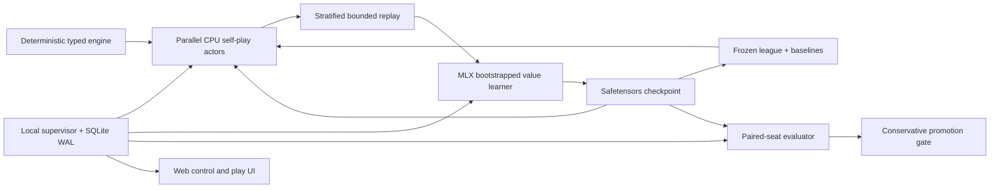

# Astrosynapse 2 design

Astrosynapse 2 is a clean self-play system for the original Star Realms base set. It reuses the legacy card catalog as a reference, but it does not reuse the old neural representation, PPO loop, promotion logic, mutable chooser state, or training GUI.

The design target is the strongest model this specific 16 GB Apple M4 machine can produce in one uninterrupted day. That is a measurable engineering target, not a promise of a particular playing strength: the dashboard reports real throughput, confidence intervals, and comparisons with frozen anchors so the result can be judged honestly.

## Why the old approach plateaued

The audit found several problems that model size could not repair:

- A match-average result was assigned to every decision from every winning and losing game in that match. Most per-game learning signal was erased.
- Rollout probabilities and PPO update probabilities were computed from different behavior policies, invalidating the importance ratios.
- Card zones were reduced to sums of hand-authored attributes. Exact card identity and within-card relationships disappeared, while arbitrary list positions became numeric features.
- Common and forced choices crowded rare tactical decisions out of the sample budget.
- A 24-game, 60% promotion gate let equal models advance by chance roughly 15% of the time.
- Each decision performed its own feature construction and tiny tensor inference, preventing useful batching.

Astrosynapse 2 gives every recorded action its own game outcome, preserves exact card identity by zone, makes decision families explicit, auto-resolves forced actions, retains rare decisions deliberately, and evaluates with paired seeds and confidence bounds.

## System map



The browser is only a client. Closing it does not stop a run. The local supervisor owns the training thread, safe-boundary controls, metrics, checkpoints, arena jobs, and interactive games.

## Learning algorithm

### Deep Monte-Carlo action values

The primary learner follows the successful shape of [DouZero](https://proceedings.mlr.press/v139/zha21a.html): score each legal semantic action and regress the chosen action toward the final game result.

For every non-forced choice made by player `p`:

```text
target = 1.0 if p wins
         0.0 if p loses
         0.5 for a genuine draw or safety truncation

loss = BCEWithLogits(Q(information_state, chosen_action), target)
```

There is no hand-authored deck-quality reward and no authority-margin reward. Winning is the policy objective. This avoids imposing the same strategic assumptions that limited the first system. Dense shaping is deliberately excluded because arbitrary shaping can change the optimal policy; the classic invariance result applies only to potential-based shaping ([Ng, Harada, and Russell](http://aima.eecs.berkeley.edu/~russell/papers/icml99-shaping.pdf)).

Monte-Carlo targets are noisy, but they are unbiased and replayable. In this domain that trade is attractive: the result is binary, legal actions vary, the game is stochastic and partially observed, and simulations are cheap. PPO would discard experience after a few updates and add policy-gradient variance. AlphaZero-style search would spend the day branching through hidden information and chance events. [ReBeL](https://proceedings.neurips.cc/paper/2020/hash/c61f571dbd2fb949d3fe5ae1608dd48b-Abstract.html) is a sound longer-term search direction, but public-belief search is not the best first use of a single M4 and a 24-hour budget.

### Coherent exploration

Three bootstrapped Q heads share the network trunk. Each player samples one head for an entire game, so exploration follows a coherent value hypothesis instead of making unrelated random moves at every chooser call. Samples receive Bernoulli bootstrap masks. The idea follows [Bootstrapped DQN](https://proceedings.neurips.cc/paper/2016/hash/8d8818c8e140c64c743113f563cf750f-Abstract.html) and randomized-prior exploration can be added without changing the engine ([Osband et al.](https://arxiv.org/abs/1806.03335)). Deployment averages the heads and chooses greedily.

### Representation

There is no meaningful spatial grid, so a CNN is the wrong inductive bias. The fixed base set is small enough to retain an exact count for every card in every observable zone:

- own hand, draw bag, discard, ships, bases, and known top;
- opponent public discard, ships, bases, known hand/top, and an unknown pool;
- the five-card trade row and remaining public supply information;
- authorities, resources, discard obligations, turn/seat, and rule flags.

Unordered zones are counts, never shuffled list positions. Unobservable opponent hand/deck assignment and deck order are never policy inputs; the publicly inferable combined hidden-pool composition is retained. Every candidate action has semantic features: verb, decision family, source/target zones, source/target card IDs, ability, and actual resource amounts. Opaque engine indices are not learned features.

The compact default network has separate state and action trunks, pre-normalized residual blocks, a decision-family-specific output bank, and three outcome heads. It is deliberately small enough that simulation and learning both make progress within a day. Exact card-by-zone counts retain the relevant structure without the cost of a large transformer; a future entity-transformer backend can use the same engine and replay schema. The permutation-invariance rationale is consistent with [Deep Sets](https://proceedings.neurips.cc/paper/2017/hash/f22e4747da1aa27e363d86d40ff442fe-Abstract.html).

### Replay

Replay is a bounded, preallocated NumPy ring rather than Python objects. It stores encoded state, chosen action, terminal target, family, bootstrap mask, age, and sampling weight. Fixed family capacity quotas keep discard, scrap, copy, modal, destroy-base, and free-acquire choices visible even though main-phase decisions are common. Forced one-option calls never consume inference or replay.

Ordinary TD-error prioritization is not used: in a high-randomness terminal-reward game it tends to over-sample irreducibly lucky wins and losses. Recent data receives a controlled fraction while older samples remain available until their family ring overwrites them.

## League self-play

Naive latest-vs-latest self-play can cycle or forget. The implemented opponent schedule therefore mixes:

- current self-play;
- prioritized frozen history, favoring opponents the current model struggles with;
- deterministic balanced, economic, and aggressive anchor bots.

The scheduling rationale follows the league and prioritized-fictitious-self-play ideas used by [AlphaStar](https://www.nature.com/articles/s41586-019-1724-z). Matchup estimates use a small Beta prior so a few lucky games cannot dominate scheduling.

Internal Elo is displayed only as a convenience. It is not treated as absolute strength because self-play populations may be non-transitive and selected promotions bias the scale.

## Evaluation under high variance

Every evaluation seed produces two games with swapped seats. Random streams for the trade deck and player shuffles are isolated from policy exploration and observation construction. The paired seed—not each correlated game—is the statistical unit.

The 24-hour preset uses 5,000 seed pairs for an automatic promotion and permits up to 20,000 pairs for a manual close comparison. A candidate advances only when a completed internal job's paired confidence interval lower bound clears 50% plus the configured margin. Manual and undersized jobs never change champion state. First- and second-seat scores and truncations are reported separately.

At a true 50% rate, 10,000 independent games have a worst-case approximate 95% half-width of 0.98 percentage points. Pairing often removes deal/seat noise, but Astrosynapse 2 measures that benefit with a paired bootstrap rather than assuming it.

## M4 execution strategy

[MLX](https://ml-explore.github.io/mlx/build/html/) is designed for Apple silicon and unified memory. The learner runs on Metal while CPU actor processes simulate games with a small NumPy mirror of the exact network. This avoids creating a Metal context in every actor and lets the expensive state trunk be computed once per decision, then shared across all legal candidates. Checkpoints use safetensors; actors receive compact `.npz` inference snapshots.

The base M4 Mac mini has a 10-core CPU, 10-core GPU, 16-core Neural Engine, 16 GB unified-memory configurations, and 120 GB/s memory bandwidth ([Apple specifications](https://support.apple.com/en-asia/121555)). MLX exposes GPU and CPU execution; this design does not pretend that the Neural Engine is available for online training. A frozen model can later be evaluated for Core ML play-only export.

Memory is budgeted rather than filled blindly:

| Consumer | 24-hour target |
|---|---:|
| Replay | up to about 3 GB |
| Actor results and game states | below 1.5 GB |
| Model, optimizer, Metal graphs, batches | below 3 GB |
| Frozen actor weights | below 0.5 GB |
| macOS, dashboard, and pressure headroom | at least 4–5 GB |

The dashboard surfaces CPU, resident/unified memory, Metal allocation, games/s, decisions/s, learner steps/s, and projected 24-hour totals. If memory pressure or throughput is poor, reduce replay or width before reducing evaluation quality.

PyTorch's official [MPS backend](https://docs.pytorch.org/docs/stable/notes/mps.html) remains a reasonable future fallback, but maintaining two learner implementations in the first release would reduce validation time without increasing playing strength.

## 24-hour recipe

| Elapsed time | Work |
|---|---|
| 0–10 min | Rule/property smoke tests, Metal check, actor/model micro-benchmarks |
| 10–30 min | Heuristic-trajectory curriculum (first 2,000 updates), then high exploration; no promotion claims |
| 0.5–3 h | Bootstrapped current self-play; regular frozen snapshots |
| 3–18 h | Full historical league and hard-opponent scheduling |
| 6–22 h | Continue mixed self-play while monitoring head uncertainty and hard opponents |
| 18–22 h | Hard-opponent refinement and lower exploration |
| 22–23.5 h | Low learning rate, consolidation, no architecture changes |
| 23.5–24 h | Let scheduled evaluation continue; preserve both champion and latest candidate for a final paired comparison |

Throughput targets are gates, not marketing numbers. The initial integrated benchmark should aim for at least 2,000 neural chooser decisions/s. A healthy optimized run may reach tens to low hundreds of games/s depending on learned game length and actor count. The GUI projects totals from the measured rate instead of claiming a fixed number in advance.

## Extensibility

The typed engine boundary is intentionally independent from the learner:

```text
reset(seed, starting_seat) -> Decision
apply(action_id) -> Decision | Terminal | Truncated
observe(perspective) -> immutable information state
serialize_replay() -> seed + semantic action log
```

That boundary permits a future Rust vector engine, centralized fixed-shape Metal inference buckets, recurrent history, belief auxiliaries, or ReBeL-style public-belief search without returning to the legacy trainer. The Python engine in this release is the correctness reference and working production fallback; native acceleration should be accepted only after differential replay tests pass.

## Honest limitations

- No self-play method can guarantee an “excellent” model before measured comparisons; a day is a hard compute budget, not a strength certificate.
- The original base-set rules and card fixtures must be validated before trusting long runs.
- A single machine cannot both maximize simulation and run enormous evaluation continuously; evaluation is scheduled in blocks.
- Terminal Monte-Carlo labels remain noisy. The answer is paired evaluation, large replay, coherent exploration, and later selective reanalysis—not invented dense rewards.
